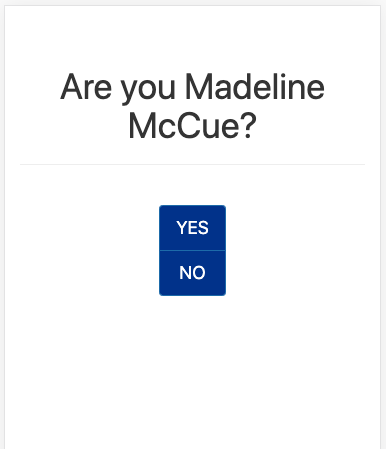
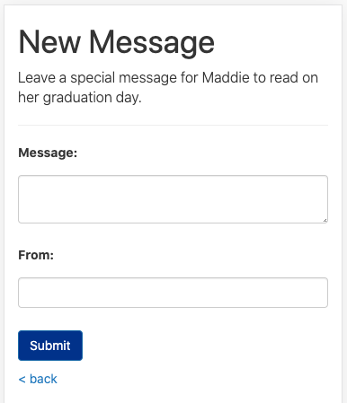
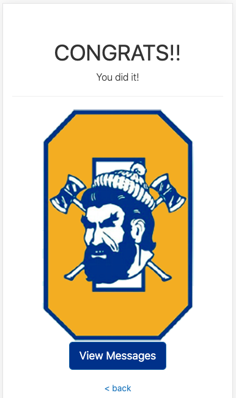
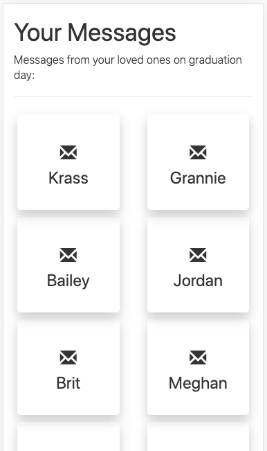
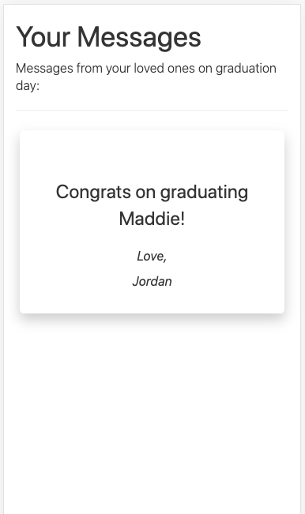

# Grad App

An app built as a graduation gift for my sister. 

It's a place for friends and family to leave her congratulations messages that she can go back and view any time. 

## Deployed App

https://maddie2020.herokuapp.com/

## Built With

* Ruby
* Rails
* JavaScript
* jQuery
* Bootstrap
* ActiveRecord/PostgreSQL
* Heroku 

## Design Examples
### Homepage


### Homepage (after click)


### New Message


### Congratulations


### Messages List


### Message 
Opens from click on message in message list & closes on click of message (using jQuery).



## Getting Started

First, clone this repository. Then:

```
bundle install
bin/rails db:create
bin/rails db:migrate
```

## Running the program locally

### Start Server

```sh
$ rails server
```

### View in Browser

```
localhost:3000
```